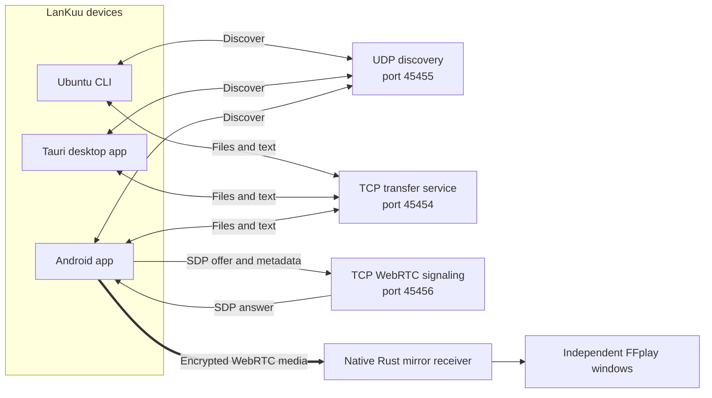
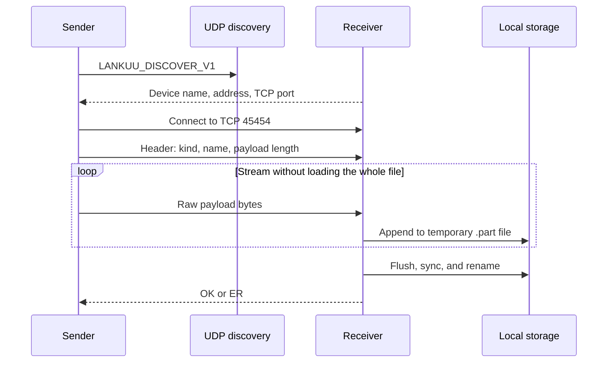
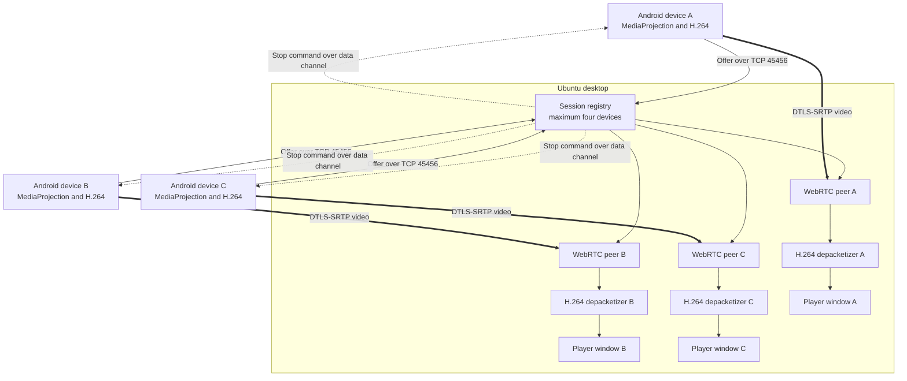
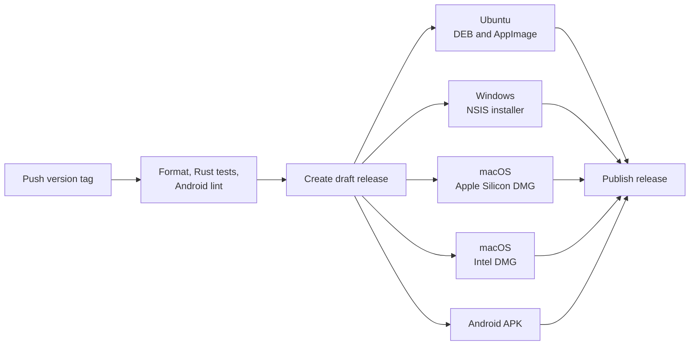

# LanKuu

[](https://github.com/Kaung-Myat/LanKuu/actions/workflows/release.yml)
[](https://github.com/Kaung-Myat/LanKuu/releases)
[](LICENSE)

**Fast, private file sharing and multi-device screen mirroring over your local
network.**

LanKuu connects nearby devices directly over the same Wi-Fi or Ethernet
network. It can stream large files without loading them into memory, exchange
text, discover receivers automatically, and mirror up to four Android screens
to an Ubuntu desktop at the same time. No account or cloud relay is required.

> [!IMPORTANT]
> LanKuu is currently an MVP. Use it only on a trusted local network. File and
> text transfers are not yet encrypted or authenticated. WebRTC mirroring media
> is encrypted with DTLS-SRTP, but signaling and device identity are not yet
> authenticated.

## Contents

- [Highlights](#highlights)
- [Platform status](#platform-status)
- [System architecture](#system-architecture)
- [Quick start](#quick-start)
- [File and text transfer](#file-and-text-transfer)
- [Multi-device screen mirroring](#multi-device-screen-mirroring)
- [Build from source](#build-from-source)
- [Release automation](#release-automation)
- [Security and limitations](#security-and-limitations)
- [Roadmap](#roadmap)

## Highlights

- Direct LAN transfer with no account, cloud storage, or Internet connection
- Streaming file I/O suitable for multi-gigabyte files
- UTF-8 text sharing and ordered multi-file batches
- UDP discovery with manual IP connection as a fallback
- Collision-safe file names and temporary files for incomplete transfers
- Native Ubuntu CLI and a Tauri desktop interface
- Android sender and receiver with a safe-area-aware multi-screen interface
- Up to four concurrent Android-to-desktop WebRTC mirror sessions
- Hardware H.264 capture, adaptive WebRTC transport, and independent players
- Per-device Play and Stop controls without interrupting other mirror sessions
- Automated Ubuntu, Windows, macOS, and Android release builds

## Platform status

| Platform | File and text transfer | Screen mirroring | Status |
|---|---|---|---|
| Ubuntu CLI | Send and receive | — | Supported |
| Ubuntu desktop | Send and receive | Receive up to four Android streams | Primary tested desktop |
| Android 10+ | Send and receive | Share the Android screen | Supported |
| Windows | Desktop build available | Runtime validation pending | Preview |
| macOS Intel / Apple Silicon | Desktop build available | Runtime validation pending | Preview |
| iOS | — | — | Planned |

## System architecture

LanKuu separates discovery, transfer, signaling, and media traffic so that a
large file cannot block discovery or another mirror session.



### Network services

| Purpose | Transport | Port | Notes |
|---|---|---:|---|
| File and text transfer | TCP | `45454` | One connection per payload |
| Nearby-device discovery | UDP | `45455` | Broadcast query, unicast response |
| Mirror signaling | TCP | `45456` | Length-prefixed SDP exchange |
| Mirror media and control | WebRTC | Dynamic UDP | DTLS-SRTP media and data channel |

Guest Wi-Fi, client isolation, VPN software, or a firewall may prevent devices
from discovering or reaching one another even when they appear to use the same
network.

## Quick start

Download the appropriate package from
[GitHub Releases](https://github.com/Kaung-Myat/LanKuu/releases).

### Ubuntu desktop

Install the Debian package:

```bash
sudo apt install ./LanKuu_*.deb
```

The Debian package declares FFmpeg as a dependency because native mirror
windows use `ffplay`. If you use the AppImage, install FFmpeg separately:

```bash
sudo apt install ffmpeg
```

Launch LanKuu, turn on **Ready to receive**, and select a nearby device or enter
its IP address manually.

### Android

Install the release APK, allow Android to install the package when prompted,
and open LanKuu. Use:

- **Share** to send text or one or more files;
- **Cast** to mirror the Android screen to a desktop;
- **Inbox** and **Activity** to inspect received content and transfers.

The current CI artifact is debug-signed for MVP testing. Production signing is
required before Play Store distribution.

### Ubuntu CLI (source build)

Build the CLI first:

```bash
cargo build --release -p lankuu
```

Start a receiver:

```bash
./target/release/lankuu receive
```

Discover receivers, send a file, or send text:

```bash
./target/release/lankuu discover
./target/release/lankuu send 192.168.1.42 ./large-file.iso
./target/release/lankuu send-text 192.168.1.42 "mingalaba"
```

Received files default to `~/Downloads/LanKuu`. Run
`./target/release/lankuu help` to see all options, including custom bind
addresses, output directories, ports, and single-transfer receiver mode.

## File and text transfer

Every selected file is sent through an independent protocol v1 connection.
The receiver streams the declared number of bytes into a temporary file,
flushes it to disk, publishes it under a collision-safe name, and only then
returns an acknowledgment.



Multi-file selections repeat this flow in order. A failed item does not cancel
the remaining batch. Text is UTF-8 and limited to 16 MiB. See
[`docs/protocol-v1.md`](docs/protocol-v1.md) for the byte-level frame format and
compatibility rules.

## Multi-device screen mirroring

### Start mirroring

1. Connect the Android devices and Ubuntu computer to the same trusted network.
2. Open **Mirror** on the desktop and select **Start mirror receiver**.
3. Open **Cast** on Android and select the discovered desktop, or enter the
   desktop IP address shown by LanKuu.
4. Select **Start mirroring** and approve Android's system capture prompt.
5. Repeat on additional phones. The desktop accepts up to four active sources.

Each source owns an independent WebRTC peer connection, lifecycle state,
control channel, H.264 pipeline, and native player. Stopping one source does not
interrupt the others.



Android captures at up to 30 fps with a 1280-pixel longest-side cap. Native
Rust code terminates WebRTC, reconstructs complete Annex-B H.264 access units,
and feeds an independent low-latency FFplay process for every session. The
desktop caches SPS/PPS plus the current GOP so reopening a player does not wait
on a new key frame or begin with missing frame references.

The mirror is currently video-only and view-only. Phone audio and desktop
keyboard/mouse control are not implemented. See
[`docs/mirror-v3.md`](docs/mirror-v3.md) for signaling, session states, control
messages, compatibility, and decoder behavior.

## Build from source

### Requirements

- Rust stable toolchain
- Java 17 for Android builds
- Android SDK for the APK
- Tauri 2 Linux development packages and FFmpeg for Ubuntu desktop builds

Install the Ubuntu desktop requirements:

```bash
sudo apt install \
  build-essential curl file wget \
  libwebkit2gtk-4.1-dev libsoup-3.0-dev \
  libxdo-dev libssl-dev libayatana-appindicator3-dev librsvg2-dev \
  ffmpeg
```

### Rust workspace and CLI

```bash
cargo test --workspace
cargo build --release -p lankuu
./target/release/lankuu --version
```

### Desktop application

Run a development build:

```bash
cargo run -p lankuu-desktop
```

Build the optimized executable:

```bash
cargo build --release -p lankuu-desktop
```

### Android application

```bash
cd android
./gradlew lintDebug
./gradlew assembleDebug
```

The APK is written to
`android/app/build/outputs/apk/debug/app-debug.apk`.

## Release automation

Pushing a tag matching `v*` starts
[`release.yml`](.github/workflows/release.yml).



The release remains a draft unless every platform job succeeds.

## Repository layout

```text
LanKuu/
├── android/                 Kotlin Android application
├── crates/
│   ├── lankuu-core/        Shared Rust protocol and network helpers
│   └── lankuu-cli/         Native command-line application
├── desktop/
│   ├── src-tauri/          Tauri commands and native WebRTC receiver
│   └── ui/                 Dependency-free HTML, CSS, and JavaScript UI
├── docs/
│   ├── protocol-v1.md      File and text wire protocol
│   └── mirror-v3.md        Multi-session WebRTC mirror protocol
└── .github/workflows/      Verification and cross-platform releases
```

## Security and limitations

- File and text traffic has no encryption, authentication, pairing, or
  receiver approval yet.
- Mirror media is encrypted by WebRTC, but TCP signaling and device metadata
  are not authenticated.
- Interrupted transfers cannot resume and do not yet have an application-level
  content checksum.
- Android receives only while its app process remains active.
- Mirroring has no audio or remote keyboard, mouse, or touch control.
- Windows and macOS artifacts are produced by CI but still require broader
  runtime and UX testing.
- Android implements protocol v1 in Kotlin. Moving the transfer engine into the
  shared Rust core through JNI is a future hardening step.

Do not expose ports `45454`–`45456` to the public Internet.

## Roadmap

1. Trusted-device pairing, receiver approval, and encrypted transfers
2. Chunk verification, pause, retry, and interrupted-transfer resume
3. Android foreground transfer service and share-sheet integration
4. Mirror quality profiles, latency metrics, screenshots, and recording
5. Audio forwarding and optional clipboard synchronization
6. Production hardening for Windows and macOS, followed by iOS support

## Contributing

Issues and focused pull requests are welcome. Before submitting a change:

```bash
cargo fmt --all -- --check
cargo test --workspace
cd android && ./gradlew lintDebug
```

Protocol changes must preserve the compatibility rules documented under
[`docs/`](docs/), or introduce an explicit new protocol version.

## License

LanKuu is available under the [MIT License](LICENSE).
